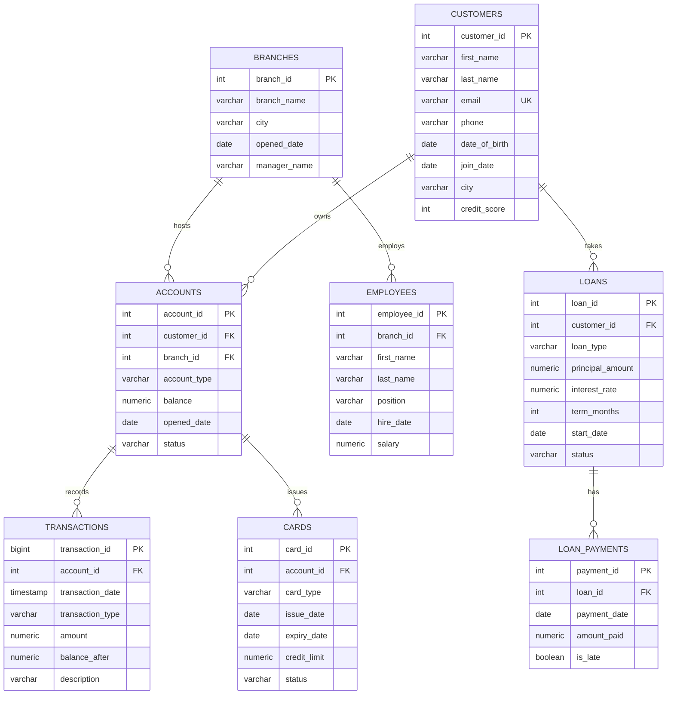

Entity-Relationship Diagram

```mermaid
erDiagram
    BRANCHES ||--o{ ACCOUNTS : "hosts"
    BRANCHES ||--o{ EMPLOYEES : "employs"
    CUSTOMERS ||--o{ ACCOUNTS : "owns"
    CUSTOMERS ||--o{ LOANS : "takes"
    ACCOUNTS ||--o{ TRANSACTIONS : "records"
    ACCOUNTS ||--o{ CARDS : "issues"
    LOANS ||--o{ LOAN_PAYMENTS : "has"

    BRANCHES {
        int branch_id PK
        varchar branch_name
        varchar city
        date opened_date
        varchar manager_name
    }

    CUSTOMERS {
        int customer_id PK
        varchar first_name
        varchar last_name
        varchar email UK
        varchar phone
        date date_of_birth
        date join_date
        varchar city
        int credit_score
    }

    EMPLOYEES {
        int employee_id PK
        int branch_id FK
        varchar first_name
        varchar last_name
        varchar position
        date hire_date
        numeric salary
    }

    ACCOUNTS {
        int account_id PK
        int customer_id FK
        int branch_id FK
        varchar account_type
        numeric balance
        date opened_date
        varchar status
    }

    TRANSACTIONS {
        bigint transaction_id PK
        int account_id FK
        timestamp transaction_date
        varchar transaction_type
        numeric amount
        numeric balance_after
        varchar description
    }

    CARDS {
        int card_id PK
        int account_id FK
        varchar card_type
        date issue_date
        date expiry_date
        numeric credit_limit
        varchar status
    }

    LOANS {
        int loan_id PK
        int customer_id FK
        varchar loan_type
        numeric principal_amount
        numeric interest_rate
        int term_months
        date start_date
        varchar status
    }

    LOAN_PAYMENTS {
        int payment_id PK
        int loan_id FK
        date payment_date
        numeric amount_paid
        boolean is_late
    }
```
